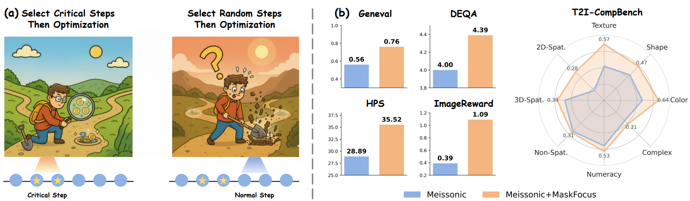

<div align="center">
    <h1 align="center"> MaskFocus: Focusing Policy Optimization on Critical Steps for Masked Image Generation
    </h1>
</div>
<div align="center">
    <!-- <a href="https://arxiv.org/abs/2509.22485">
        
    </a>&nbsp; -->
    <a href="https://huggingface.co/collections/zghhui/maskfocus">
        
    </a>&nbsp;
    <a href="https://github.com/zghhui/MaskFocus">
        
    </a>
</div>

## 🔈 News
- [2025-12] All weights are avialable on [Huggingface](https://huggingface.co/collections/zghhui/maskfocus)!
- [2025-12] Train and inference code are avialable
<!-- - [2025-12] MaskFocus is released on [Arixv](). -->

## 🔍 Introduction
Masked Generative Models (MGMs) have emerged as an efficient alternative for high-quality image generation ⚡️, due to their iterative *non-autoregressive* sampling that predicts masked tokens in parallel. While reinforcement learning (RL) 🧠 has recently boosted performance for autoregressive models and diffusion models, applying RL to MGMs is challenging because different sampling steps contribute **unequally** to the final image. **MaskFocus** addresses this by focusing 🔍  optimization on the **most critical steps** in the sampling trajectory.
<div style="text-align: center; width: 100%;">
    
</div>

## Highlights ✨
- **Critical-step selection** 🧩: prioritize the most valuable sampling steps to balance compute and performance.
- **All-masked-token optimization** 🎯: use all masked tokens in critical steps for better probability estimation.
- **Entropy-based dynamic routing** 🌪️: encourage exploration by routing low-entropy samples to more exploratory sampling paths.

## 🤗 Model List

[🤗Meissonic_HPS](https://huggingface.co/zghhui/Meissonic_MaskFocus_HPS)            |  [🤗Meissonic_GenEval](https://huggingface.co/zghhui/Meissonic_MaskFocus_GenEval)                


## 🔧 Environment SetUp
#### 1. Clone this repository and navigate to the folder:
```bash
git clone https://github.com/zghhui/MaskFocus.git
cd MaskFocus
```

#### 2. Install the training package:
We provide training codes for **Meissonic** and recommend installing a new environments for it.

```bash
conda create -n meissonic_rl python=3.10
conda activate meissonic_rl
pip install -r requirements.txt
```

#### 3. Download Models

```bash
huggingface-cli download MeissonFlow/Meissonic
huggingface-cli download laion/CLIP-ViT-H-14-laion2B-s32B-b79K
```

**For HPS Reward:**

```bash
huggingface-cli xswu/HPSv2
```

**For Geneval Reward**: 

- Please according to the instructions in [Flow-GRPO](https://github.com/yifan123/flow_grpo?tab=readme-ov-file) and [reward-server](https://github.com/yifan123/reward-server).

## 🚀 Training MaskFocus

```bash
cd src
bash scripts/run_grpo.sh
```
> [!Note]
>
> Remember to modify the CLIP path in `meissonic_rl/src/maskfocus/src/utils/reward_hps.py` (line 19)


## 💫 Inference

```bash
cd src
bash scripts/inference.sh
```


## 📧 Contact
If you have any comments or questions, please open a new issue.


## 🤗 Acknowledgments
Our training code is based on [GCPO](https://github.com/zghhui/GCPO), [T2I-R1](https://github.com/CaraJ7/T2I-R1), [SimpleAR](https://github.com/wdrink/SimpleAR), and [Flow-GRPO](https://github.com/yifan123/flow_grpo).

Thanks to all the contributors!

## ⭐ Citation
<!-- If you find MaskFocus useful for your research or projects, we would greatly appreciate it if you could cite the following paper:
```
@article{zhang2025group,
  title={Group Critical-token Policy Optimization for Autoregressive Image Generation},
  author={Zhang, Guohui and Yu, Hu and Ma, Xiaoxiao and Zhang, JingHao and Pan, Yaning and Yao, Mingde and Xiao, Jie and Huang, Linjiang and Zhao, Feng},
  journal={arXiv preprint arXiv:2509.22485},
  year={2025}
} -->
```